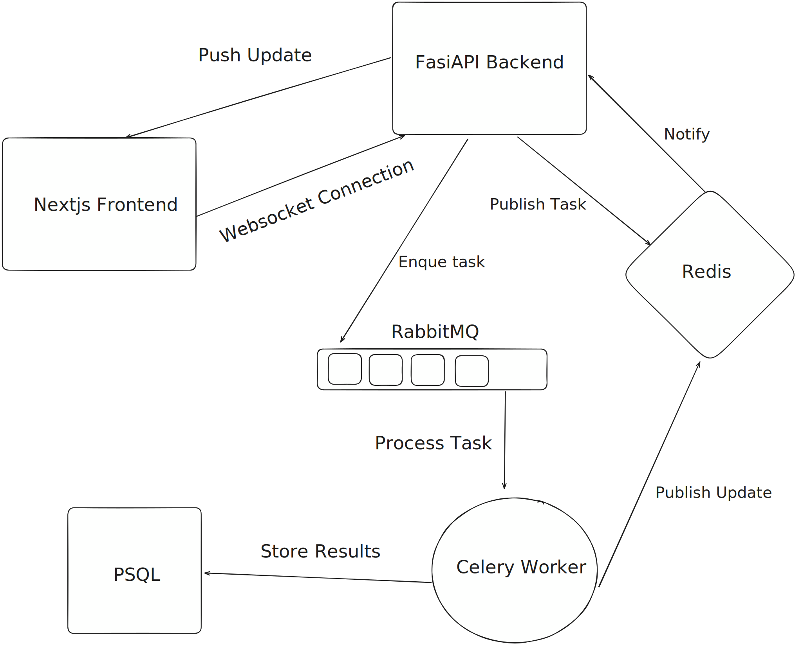
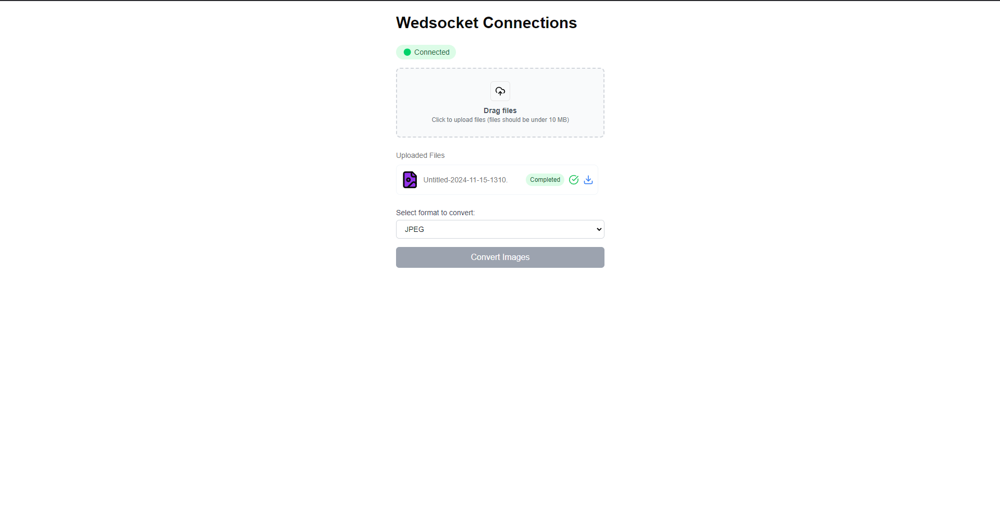

# Full-Stack Image Conversion Application with Pub-Sub Communication

This repository contains a full-stack image conversion application built with FastAPI, WebSockets, and Docker. The project demonstrates backend communication using a pub-sub model.

## HighLevel Architecture Diagram



## Screenshot


## Technologies Used

### Backend
- **FastAPI**: A modern, fast (high-performance), web framework for building APIs with Python 3.6+ based on standard Python type hints.
- **WebSockets**: Enables real-time communication between the client and the server.
- **Redis**: Used as a message broker for Pub/Sub functionality.
- **RabbitMQ** - Message broker for task queue management
- **PostgreSQL**: A powerful, open-source object-relational database system.
- **Alembic**: A lightweight database migration tool for use with SQLAlchemy.
- **Celery**: An asynchronous task queue/job queue based on distributed message passing.
- **Docker**: Used to containerize the application for easy deployment and scalability.

### Frontend
- **Next.js**: A React framework for server-rendered or statically-exported React applications.
- **Tailwind CSS**: A utility-first CSS framework for rapidly building custom user interfaces.

### Backend
The backend is built with FastAPI and includes the following components:
- **API Router**: Defines the API endpoints and handles HTTP requests.
- **WebSocket Endpoint**: Manages WebSocket connections for real-time communication.
- **Redis**: Used for Pub/Sub messaging to handle real-time updates.
- **PostgreSQL**: Stores application data.
- **Alembic**: Manages database migrations.
- **Celery**: Handles background tasks and asynchronous processing.

### Frontend
The frontend is built with Next.js and includes the following components:
- **Pages**: Defines the different pages of the application.
- **Components**: Reusable UI components built with React and styled with Tailwind CSS.

### Docker
The application is containerized using Docker, with the following services defined in the `docker-compose.yml` file:
- **PostgreSQL**: Database service.
- **Redis**: Message broker service.
- **RabbitMQ**: Message broker for Celery tasks.
- **Backend**: FastAPI application service.
- **Frontend**: Next.js application service.

## Getting Started

### Prerequisites
- Docker and Docker Compose installed on your machine.

### Running the Application
```
# Clone repository
git clone https://github.com/Amaljith64/fastapi-nextjs-websocket-pubsub

# Copy env and add your credentials
cp .env.template .env

# Start services
docker compose up -d --build

# Run database migrations
docker compose exec backend alembic upgrade head

```
